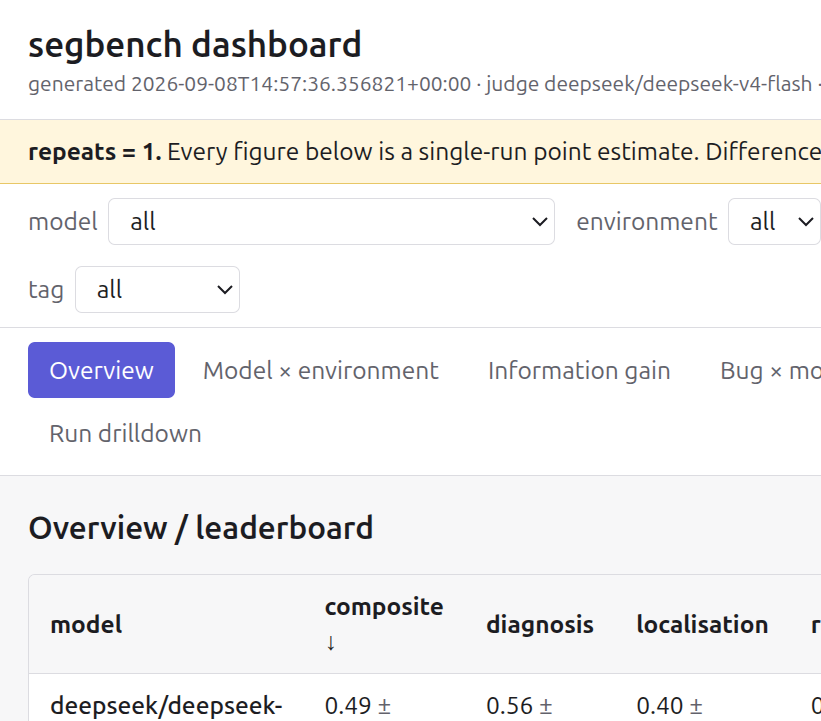

# SEGbench

A benchmark harness measuring how well an LLM agent can **diagnose** real defects in Canonical
products — Sunbeam, Charmed OpenStack, Juju, MicroK8s, the Ubuntu kernel. Each task is one real
bug; the agent is scored on whether it identifies the right component, the right code, the right
root cause and a plausible fix, not on producing a passing test.

`plan.md` is the design document and the source of truth. `CLAUDE.md` is the working context for
coding agents.

## Setup

```bash
uv sync
cp segbench.example.toml segbench.toml     # then edit
uv run segbench --help
```

## Container images

The harness runs each task in a container built from a definition under [images/](images/):

| definition | alias | contents |
|---|---|---|
| [base.yaml](images/base.yaml) | `segbench-base` | Ubuntu 24.04, Python 3.12, git, ripgrep, fd, jq, build-essential, standard text tooling, `opencode` |
| [overlays/kernel.yaml](images/overlays/kernel.yaml) | `segbench-kernel` | `crash`, `linux-tools`, `trace-cmd`, `pahole`, cscope/ctags — selected by `bug.product: kernel` |

```bash
segbench image build                    # base image
segbench image build --overlay kernel   # kernel overlay (builds the base first)
segbench image build --force            # rebuild even if the definition is unchanged
segbench image status                   # aliases, digests, staleness
```

**How long it takes.** From cold, the base image is roughly **3 minutes** and the kernel overlay
another **3 minutes** on a reasonable connection; most of that is `apt-get` and the ~180 MB
`opencode` download. A no-op rebuild is under a second. Times are dominated by network, so a slow
archive mirror can easily double them.

**What the build depends on.**

- **LXD**, initialised, with this user in the `lxd` group (`snap install lxd && lxd init`).
  `segbench image build` and `segbench runtime smoke` fail with an explicit message if the daemon
  is unreachable.
- **Outbound network in the build container** — the Ubuntu archive and `opencode.ai`. The build
  container uses the default LXD bridge and is the only container in the harness with real egress;
  it never runs agent code. Benchmark runs have no egress at all beyond the phase 3 proxy.
- **The upstream `ubuntu:24.04` LXD image**, pulled on first build and cached by LXD.

Builds are idempotent: an image whose definition and provisioning script are unchanged, and whose
alias still resolves to the recorded fingerprint, is left alone. The digest is recorded in
`.cache/images/images.json` and is stamped onto every run record.

## Checking the runtime

```bash
segbench runtime smoke                          # against the base image
segbench runtime smoke --image segbench-kernel   # against an overlay
```

Creates a container, execs as root and as the unprivileged agent user, verifies the image's
tooling, round-trips a file through push and pull, proves a background process is killed inside the
container when its deadline passes, destroys the container, and prints per-step timings. A full
pass is around 25 seconds, of which about 20 is container creation.

Interrupting it with `Ctrl-C` at any point leaves no container behind: every backend registers each
container with a cleanup registry that fires on SIGINT, SIGTERM and interpreter exit.

## Corpus

```bash
segbench corpus validate                  # schema, leakage and scrubber checks over all bugs
segbench corpus add --launchpad 2048221   # scaffold a bug directory from a tracker
segbench corpus derive --bug <id> --repo <path>
```

See [docs/adding-bugs.md](docs/adding-bugs.md) for the full supervised workflow, including the
channel-splitting rules with worked good/bad examples.

## Quickstart: run a campaign and view the dashboard

```bash
export OPENROUTER_API_KEY=...
segbench netpol verify                          # prove the no-leakage invariant against a real container
segbench run campaign --tags smoke --dry-run     # see the matrix and a cost estimate first
segbench run campaign --tags smoke               # execute it
segbench grade                                   # deterministic checks + LLM judge
segbench export                                  # writes dashboard/public/data.json
cd dashboard && npm install && npm run build && npm run preview
```

Open the printed preview URL to see the leaderboard, model×environment heatmap, information-gain
chart, bug×model matrix, failure-mode breakdown, cost/score frontier, and a drillable run table —
all rendered from `data.json`, no server or database involved.



*Screenshot from the smoke campaign described in [docs/operations.md](docs/operations.md) — one
real Launchpad bug, three environments, two models. `n=1` bug; this is a pipeline demonstration, not
a capability result. See [docs/methodology.md](docs/methodology.md) for what the benchmark measures
and its current limitations, and [docs/operations.md](docs/operations.md) for running a full
campaign, budget planning, resumption, and troubleshooting.*

## Documentation

- [plan.md](plan.md) — the full design document; source of truth.
- [docs/methodology.md](docs/methodology.md) — what's measured, environments, leakage prevention
  (with real `netpol verify` output), scoring rubric, occlusion design, and an honest limitations
  section.
- [docs/adding-bugs.md](docs/adding-bugs.md) — the supervised workflow for turning a tracker bug
  into a corpus entry.
- [docs/operations.md](docs/operations.md) — running a campaign, budget planning, resumption,
  troubleshooting, recommended staging, and measured smoke-campaign numbers.
- [docs/judge-validation.md](docs/judge-validation.md) — the judge hand-grading/agreement process.
- [docs/todo.md](docs/todo.md) — deferred work (plan.md §12), tracked so it stays visible.

## Development

```bash
uv run ruff check . && uv run ruff format --check .
uv run pytest
```

The test suite does not need LXD; the backends are exercised through fakes, and
`segbench runtime smoke` is the acceptance check against the real thing.
